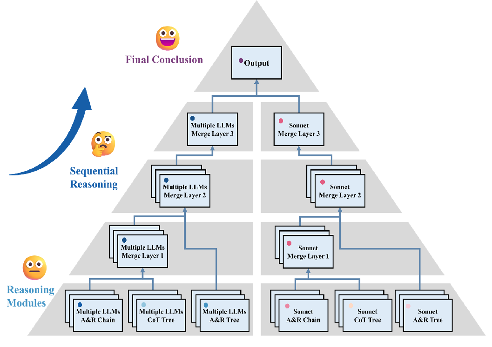

# LLM Pyramid Framework for Diagnosis---Medical Diagnosis Multi-LLM Collaboration System

English | [中文](README_CN.md)

This is a medical diagnosis system based on multiple Large Language Models (LLMs) collaboration. The system adopts a pyramid framework structure, utilizing repeated sampling, multiple prompt sampling, and multiple LLMs sampling, along with multi-round dialogues to provide more accurate medical diagnosis suggestions.

## System Architecture

The system consists of the following main components:

### 1. Model Structure
- Pyramid framework structure
- Multiple collaboration modules:
  - AR Chain Module (Multiple/Single)
  - AR Tree Module (Multiple/Single)
  - CoT Tree Module (Multiple/Single)
- Each module contains multiple levels, supporting parallel processing
The modules include LLM1-4, where LLM4 is the main reasoning model, and LLM1-3 are collaborative models for auxiliary reasoning. Usually, LLM4 is the best-performing model, while LLM1-3 are models with slightly lower performance.

### 2. Model Configuration
LLMs are called through API management tools for various LLMs interfaces, using the requests library. Users can deploy their own API management tools through one API or new API projects for use in this project, or purchase third-party APIs.
- Supports multiple LLM models:
  - Claude-3-Sonnet
  - GPT-4
  - Gemini-1.5-Pro
  - Claude-3-Opus
  - o1-mini
  - etc.
Note: Some reasoning models may fail in parallel calls if response times are too long.

### 3. Processing Flow
1. Input layer processes case information
2. Multi-round dialogue generates preliminary diagnosis
3. Preliminary diagnosis processed through various Modules to form intermediate results
4. Merger layer integrates multi-model results
5. Output layer generates final diagnostic recommendations

## Main Features

- Multi-model parallel inference
- Multi-round dialogue
- Automatic format validation
- Checkpoint recovery
- Logging

## Key Files Description

- `main.py`: Program entry
- `framework.py`: Pyramid framework implementation
- `modules.py`: Module processing logic
- `chat2llm.py`: LLM communication interface
- `build_prompt.py`: Prompt construction
- `check_function.py`: Format checking
- `model_structure.py`: Model structure definition
- `model_config.py`: Model configuration
- `logger.py`: Logging functionality
- `checkpoint.py`: Checkpoint recovery
- `prompt_config.py`: Prompt configuration
- `parallel_query.py`: Parallel query implementation
- `get_previous_result.py`: Retrieve results from previous rounds
- `load_question.py`: Question loading functionality

### Folders
- `dataset/`: Contains dataset files
- `prompt/`: Contains prompt templates
- `results/`: Stores output results

## Usage Instructions

1. Configure model API keys
2. Prepare case data （170 NEJM case records are provided for testing）
3. Configure question list
4. Run main.py

## Dependencies

- Python 3.7+
- aiohttp
- pandas
- logging
- asyncio

## Important Notes

- API keys must be properly configured
- Ensure stable network connection
- Async IO recommended for better performance
- Verify output format correctness

## Error Handling

The system includes comprehensive error handling mechanisms:
- Automatic retry
- Format validation
- Checkpoint recovery
- Detailed logging 

The author is still learning and finds the format validation part particularly challenging. Errors may occur during operation, especially when using lower-performing LLMs as the main reasoning model. Feel free to discuss and learn together! Email: 15689983735@163.com. If there is an API call issue, please contact me, and I will share an API after seeing the message.

"# Pyramid-Framework-for-Diagnosis" 
"# LLM-Pyramid-Framework-for-Diagnosis" 
"# LLM-Pyramid-Framework-for-Diagnosis" 
"# LLM-Pyramid-Framework-for-Diagnosis" 
"# LLM-Pyramid-Framework-for-Diagnosis" 
"# LLM-Pyramid-Framework-for-Complex-Diagnosis" 
"# LLM-Pyramid-Framework-for-Diagnosis" 
"# LLM-Pyramid-Framework-for-Diagnosis" 
"# LLM-Pyramid-Framework-for-Diagnosis" 
"# LLM-Pyramid-Framework-for-Diagnosis" 
"# LLM-Pyramid-Framework-for-Diagnosis" 
"# LLM-Pyramid-Framework-for-Diagnosis-Medical-Diagnosis20250210" 

## Disclaimer and Copyright Notice

### Important Notice
This repository contains code and resources associated with our pending publication: "Enhancing Large Language Model Performance in Complex Diagnosis: A Reasoning Pyramid Framework Integrating Diverse Sampling Strategies and Hierarchical Sequential Reasoning"

### Copyright and Ownership
- All code and related resources in this repository are developed by our research team
- All rights are reserved by the original authors
- Unauthorized commercial or academic use of this code or its derivatives is strictly prohibited

### Citation Requirements
- If you reference or use this code in your research, proper attribution to our work is mandatory
- Complete citation information will be provided upon formal publication of our paper

### Prohibited Actions
- Using this code for paper submission, patent application, or other intellectual property claims without authorization
- We reserve the right to take legal action against any unauthorized use or infringement

---

