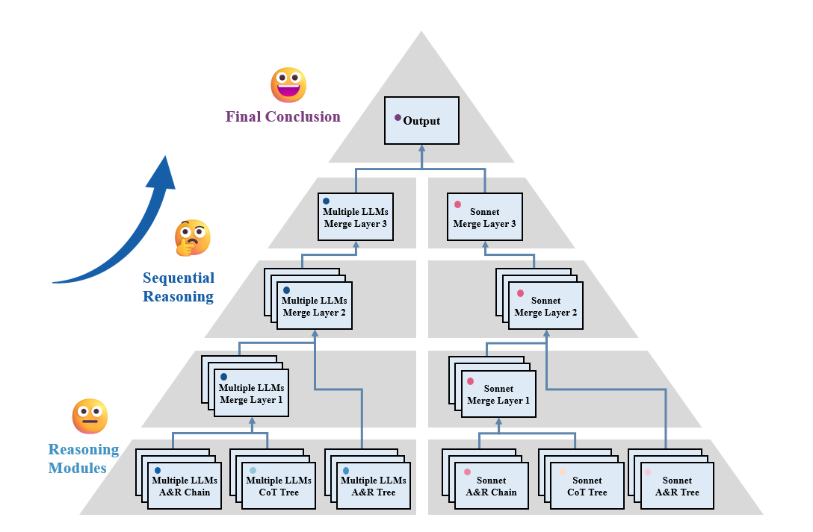

# 医疗诊断多模型协作系统

[English](README.md) | 简体中文

这是一个基于多个大语言模型(LLM)协作的医疗诊断系统。系统采用金字塔式框架结构,通过重复采样、多prompt采样和多LLMs采样，并且通过多轮对话来提供更准确的医疗诊断建议。

## 系统架构

系统主要包含以下几个部分:

### 1. 模型结构
- 采用金字塔式框架结构
- 包含多个协作模块:
  - AR链式模块 (Multiple/Single)
  - AR树状模块 (Multiple/Single) 
  - CoT树状模块 (Multiple/Single)
- 每个模块包含多个层级,支持并行处理
模块包含LLM1-4，其中LLM4是主干推理模型，LLM1-3是辅助推理的协作模型。通常LLM4是性能最好的模型，LLM1-3是性能稍ss差的模型。

### 2. 模型配置
LLMs的调用基于多种LLMs的APIs接口管理工具，通过requests库进行调用。使用者可以通过oneAPI或者newAPI项目部署自己的API管理工具后应用于本项目。或者自行某宝购买中介API。
- 支持多种LLM模型:
  - Claude-3-Sonnet
  - GPT-4o
  - Gemini-1.5-Pro
  - Claude-3-Opus
  - o1-mini
  - 等
注意：一些推理模型如果响应时间过长，并行调用可能会失败。

### 3. 处理流程
1. 输入层处理病例信息
2. 多轮对话生成初步诊断
3. 初步诊断经过多种Modules处理后行程中间结果
4. 合并层整合多模型结果
5. 输出层生成最终诊断建议

## 主要功能

- 多模型并行推理
- 多轮对话
- 自动格式校验
- 断点续传
- 日志记录

## 关键文件说明

- `main.py`: 程序入口
- `framework.py`: 金字塔框架实现
- `modules.py`: 模块处理逻辑
- `chat2llm.py`: LLM通信接口
- `build_prompt.py`: 提示词构建
- `check_function.py`: 格式检查
- `model_structure.py`: 模型结构定义
- `model_config.py`: 模型配置
- `logger.py`: 日志功能
- `checkpoint.py`: 断点续传
- `prompt_config.py`: 提示词配置
- `parallel_query.py`: 并行查询
- `get_previous_result.py`: 获取上轮结果
- `load_question.py`: 加载问题
- `modules.py`: 模块处理逻辑
- `prompt_config.py`: 提示词配置
- `parallel_query.py`: 并行查询
- `check_function.py`: 格式检查

### Folders

- `dataset/`: 数据集文件夹
- `prompt/`: 提示词模板文件夹
- `results/`: 结果文件夹

## 使用方法

1. 配置模型API密钥
2. 准备病例数据 （当前项目中已经有170个NEJM病例记录供测试使用）
3. 配置问题列表
4. 运行main.py

## 依赖项

- Python 3.7+
- aiohttp
- pandas
- logging
- asyncio

## 注意事项

- 需要正确配置API密钥
- 确保网络连接稳定
- 建议使用异步IO以提高性能
- 注意检查输出格式的正确性

## 错误处理

系统包含完整的错误处理机制:
- 自动重试
- 格式校验
- 断点续传
- 详细日志

作者是个菜鸡，回答格式验证部分让我感到很棘手，运行中有几率会出现错误，特别是性能不好的LLMs作为主干推理模型时。欢迎大家一起交流学习，Email: 15689983735@163.com

